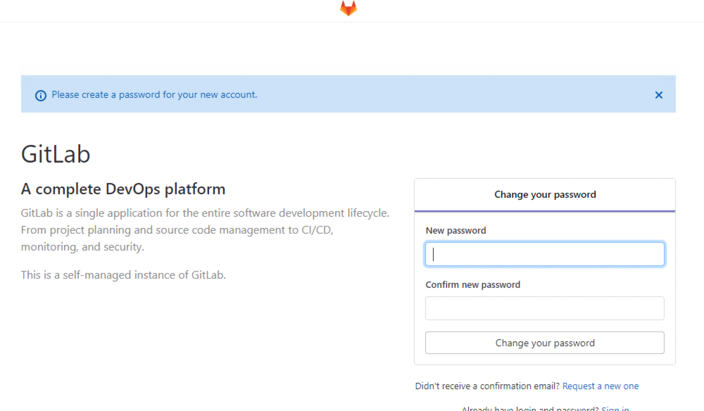

# Glitlab + S3検証
# 検証概要

https://docs.gitlab.com/ee/install/aws/

## 注意事項
- 事前にGitlab EEのFree Trialのコードを事前に取得する必要があります。取得は https://about.gitlab.com/free-trial/ にアクセスし、<b>GitLab Self-Managed</b>の<b>Start free trial</b>で情報を登録して取得します。取得したコードは、gitlabのセットアップで利用します。


# 作成手順
## (1)事前設定
### (1)-(a) 作業環境の準備
下記を準備します。もしCLI実行環境がない場合は、次の(1)-(b)を参照し、Cloud9の環境を準備して実行します。
* bashが利用可能な環境(LinuxやMacの環境)
* aws-cliのセットアップ
* AdministratorAccessポリシーが付与され実行可能な、aws-cliのProfileの設定

### (1)-(b) (Option) Cloud9環境準備
Cloud9利用のためには、インターネット経由でCloud9用のEC2インスタンスにhttpsでアクセス可能である必要があります。
#### (i) Cloud9インスタンスの作成
+ マネージメントコンソールに、AdministratorAccess権限のあるユーザでログインします。
+ サービスから<code>AWS Cloud9</code>に移動します。
+ <code>Create environment</code>ボタンを押します。
+ Name environment
  + NameとDescriptionに任意の情報を入れます。
+ Environment settings  *デフォルトのままでOKですが、念の為記載します。
  + Environment type: <code>Create a new EC2 instance for environment (direct access)</code>を選択
  + Instance type: <code>t2.micro (1 GiB RAM + 1 vCPU)</code>を選択
  + Platform: <code>Amazon Linux</code>
+ Network settings (advanced):
  + デフォルトでは、デフォルトVPCにデプロイされます。基本そのままにします。
+ 設定内容確認
  + 設定内容を確認し、<code>Create environment</code>を実行。
#### (ii) Cloud9環境のアクセスと環境の確認
インスタンスが作成されると、下記のようなCloud9の操作画面がブラウザに表示されます。
以後は、右下のコマンドラインで作業を行います。(画面が小さい場合はコマンドラインを上に拡大することが可能です。)


#### (iii) AWS CLIの実行確認 
コマンドラインで、aws CLIが利用できることを確認します。stsコマンドで、実行に利用するセッション情報が表示できることを確認します。以下の形式でCloud9のインスタンスを作成したユーザの権限情報が表示されれば成功です。

```shell
aws sts get-caller-identity
{
    "UserId": "XXXXXXX:XXXXXX",
    "Account": "999999999999",
    "Arn": "arn:aws:sts::999999999999:XXXXXXX/XXXXXX"
}
```
### (1)-(b) 環境作成用ファイルのClone
この構築用のファイル一式を実行環境で展開します。

#### (i) git clone
下記コマンドで検証用資材をgit cloneします。
```shell
git clone https://github.com/Noppy/gitlab-and-s3-PoC.git
cd gitlab-and-s3-PoC/
```
### (1)-(c) CLI実行用の事前準備
これ以降のAWS-CLIで共通で利用するパラメータを環境変数で設定しておきます。
```shell
export PROFILE=default #aa#デフォルト以外のプロファイルの場合は、利用したいプロファイル名を指定
export REGION=$(aws --profile ${PROFILE} configure get region)
echo "${PROFILE}  ${REGION}"
```

## (2)ネットワーク環境の作成(CloudFormation利用)
gitコマンド用のクライアントVPC(ClientVPC)、gitlab用VPC(GitlabVPC)を作成しTransit Gatewayで接続します。(VPC接続は、VPC Peeringでも可能)
なお、CloudFormationの進捗状況は、別途マネージメントコンソールの画面をだしCloudFormationのスタックを表示するとわかりやすいです。


### (2)-(a) ClientVPC作成
```shell
#ClientVPC
CFN_STACK_PARAMETERS='
[
  {
    "ParameterKey": "DnsHostnames",
    "ParameterValue": "true"
  },
  {
    "ParameterKey": "DnsSupport",
    "ParameterValue": "true"
  },
  {
    "ParameterKey": "InternetAccess",
    "ParameterValue": "true"
  },
  {
    "ParameterKey": "EnableNatGW",
    "ParameterValue": "false"
  },
  {
    "ParameterKey": "VpcInternalDnsNameEnable",
    "ParameterValue": "false"
  },
  {
    "ParameterKey": "VpcName",
    "ParameterValue": "ClientVPC"
  },
  {
    "ParameterKey": "VpcCidr",
    "ParameterValue": "10.1.0.0/16"
  },
  {
    "ParameterKey": "PublicSubnet1Name",
    "ParameterValue": "PubSub1"
  },
  {
    "ParameterKey": "PublicSubnet1Cidr",
    "ParameterValue": "10.1.0.0/19"
  },
  {
    "ParameterKey": "PublicSubnet2Name",
    "ParameterValue": "PubSub2"
  },
  {
    "ParameterKey": "PublicSubnet2Cidr",
    "ParameterValue": "10.1.32.0/19"
  },
  {
    "ParameterKey": "PrivateSubnet1Name",
    "ParameterValue": "PrivateSub1"
  },
  {
    "ParameterKey": "PrivateSubnet1Cidr",
    "ParameterValue": "10.1.128.0/19"
  },
  {
    "ParameterKey": "PrivateSubnet2Name",
    "ParameterValue": "PrivateSub2"
  },
  {
    "ParameterKey": "PrivateSubnet2Cidr",
    "ParameterValue": "10.1.160.0/19"
  }
]'
aws --profile ${PROFILE} cloudformation create-stack \
    --stack-name GitlabS3PoC-ClientVPC \
    --template-body "file://./cfns/vpc-4subnets.yaml" \
    --parameters "${CFN_STACK_PARAMETERS}" \
    --capabilities CAPABILITY_IAM ;
```
### (2)-(b) GitlabVPC作成
```shell
# GitlabVPC
CFN_STACK_PARAMETERS='
[
  {
    "ParameterKey": "DnsHostnames",
    "ParameterValue": "true"
  },
  {
    "ParameterKey": "DnsSupport",
    "ParameterValue": "true"
  },
  {
    "ParameterKey": "InternetAccess",
    "ParameterValue": "false"
  },
  {
    "ParameterKey": "EnableNatGW",
    "ParameterValue": "false"
  },
  {
    "ParameterKey": "VpcInternalDnsNameEnable",
    "ParameterValue": "false"
  },
  {
    "ParameterKey": "VpcName",
    "ParameterValue": "GitlabVPC"
  },
  {
    "ParameterKey": "VpcCidr",
    "ParameterValue": "10.2.0.0/16"
  },
  {
    "ParameterKey": "PublicSubnet1Name",
    "ParameterValue": "TgwSub1"
  },
  {
    "ParameterKey": "PublicSubnet1Cidr",
    "ParameterValue": "10.2.0.0/19"
  },
  {
    "ParameterKey": "PublicSubnet2Name",
    "ParameterValue": "TgwSub2"
  },
  {
    "ParameterKey": "PublicSubnet2Cidr",
    "ParameterValue": "10.2.32.0/19"
  },
  {
    "ParameterKey": "PrivateSubnet1Name",
    "ParameterValue": "gitlabSub1"
  },
  {
    "ParameterKey": "PrivateSubnet1Cidr",
    "ParameterValue": "10.2.128.0/19"
  },
  {
    "ParameterKey": "PrivateSubnet2Name",
    "ParameterValue": "gitlabSub2"
  },
  {
    "ParameterKey": "PrivateSubnet2Cidr",
    "ParameterValue": "10.2.160.0/19"
  }
]'

aws --profile ${PROFILE} cloudformation create-stack \
    --stack-name GitlabS3PoC-GitlabVPC  \
    --template-body "file://./cfns/vpc-4subnets.yaml" \
    --parameters "${CFN_STACK_PARAMETERS}" \
    --capabilities CAPABILITY_IAM ;
```
### (2)-(c) TransitGateway接続(CloudFormation利用)

```shell
aws --profile ${PROFILE} cloudformation create-stack \
    --stack-name GitlabS3PoC-TGW \
    --template-body "file://./cfns/tgw.yaml" ;
```
### (2)-(d) ClientVPC VPCE作成
ClientVPCにて、Private Subnet上からAmazon Linux2のyumアップデートが可能となるよう、Amazon Linux2のyumリポジトリ用バケットへのアクセスのみ許可したS3のVPECエンドポイントを作成します。
```shell
# Internal-VPCへのVPCE作成
aws --profile ${PROFILE} cloudformation create-stack \
    --stack-name GitlabS3PoC-ClientVPC-VPCE \
    --template-body "file://./cfns/vpce_s3_clientvpc.yaml" ;
```

## (3) Security Group作成(CloudFormation利用)
EC2インスタンスに適用するSecurityGroupを作成します。
```shell
RDP_CIDR="27.0.0.0/8"

CFN_STACK_PARAMETERS='
[
  {
    "ParameterKey": "AllowRpdCidr",
    "ParameterValue": "'"${RDP_CIDR}"'"
  }
]'
aws --profile ${PROFILE} cloudformation create-stack \
    --stack-name GitlabS3PoC-SecurityGroups \
    --template-body "file://./cfns/sg.yaml" ;
```

## (4) Gitlab用S3バケットとVPCE作成(CloudFormation利用)
Gitlab用のS3バケットとGitLabVPCにVPCEを作成します。
Gitlab用のS3バケットは、GitLabVPCのVPCEからのアクセスのみ許可します。
GitLabVPCにVPCEは、Gitlab用のS3バケットとAmazon Linux2のyumリポジトリアクセスのみ許可します。
```shell
aws --profile ${PROFILE} cloudformation create-stack \
    --stack-name GitlabS3PoC-S3 \
    --template-body "file://./cfns/s3.yaml" ;
```
## (5) IAMロール作成

```shell
aws --profile ${PROFILE} cloudformation create-stack \
    --stack-name GitlabS3PoC-Iam \
    --template-body "file://./cfns/iam.yaml" \
    --capabilities CAPABILITY_IAM ;
```
## (5) Linuxクライアントインスタンスの作成
### (5)-(a) 情報設定
```shell
KEYNAME="CHANGE_KEY_PAIR_NAME"  #環境に合わせてキーペア名を設定してください。 
AL2_AMIID=$(aws --profile ${PROFILE} --output text \
    ec2 describe-images \
        --owners amazon \
        --filters 'Name=name,Values=amzn2-ami-hvm-2.0.????????.?-x86_64-gp2' \
                  'Name=state,Values=available' \
        --query 'reverse(sort_by(Images, &CreationDate))[:1].ImageId' ) ;
echo -e "KEYNAME   = ${KEYNAME}\nAL2_AMIID = ${AL2_AMIID}"
```
### (5)-(b) Bastionインスタンス作成
```shell
# Set Stack Parameters
CFN_STACK_PARAMETERS='
[
  {
    "ParameterKey": "AmiId",
    "ParameterValue": "'"${AL2_AMIID}"'"
  },
  {
    "ParameterKey": "KEYNAME",
    "ParameterValue": "'"${KEYNAME}"'"
  }
]'
# Create Bastion

aws --profile ${PROFILE} cloudformation create-stack \
    --stack-name GitlabS3PoC-Bastion  \
    --template-body "file://./cfns/bastion.yaml" \
    --parameters "${CFN_STACK_PARAMETERS}";
```
### (5)-(c) Clientインスタンス作成
```shell
# Set Stack Parameters
CFN_STACK_PARAMETERS='
[
  {
    "ParameterKey": "AmiId",
    "ParameterValue": "'"${AL2_AMIID}"'"
  },
  {
    "ParameterKey": "KEYNAME",
    "ParameterValue": "'"${KEYNAME}"'"
  }
]'
# Create Bastion

aws --profile ${PROFILE} cloudformation create-stack \
    --stack-name GitlabS3PoC-Client  \
    --template-body "file://./cfns/client.yaml" \
    --parameters "${CFN_STACK_PARAMETERS}";
```
### (5)-(d) ログイン確認とClientへのgitインストール
別ターミナルを起動し下記を実行して作成したインスタンスにログイン可能かを確認します。
```shell
#別ターミナルを起動し下記を実行

#初期化
export PROFILE=default #デフォルト以外のプロファイルの場合は、利用したいプロファイル名を指定
export REGION=$(aws --profile ${PROFILE} configure get region)
echo "${PROFILE}  ${REGION}"

#BastionのPublic IP取得
BastionIP=$(aws --profile ${PROFILE} --output text \
    cloudformation describe-stacks \
        --stack-name GitlabS3PoC-Bastion \
        --query 'Stacks[].Outputs[?OutputKey==`InstancePublicIp`].[OutputValue]')
echo "BastionIP = ${BastionIP}"

#Bastionにログイン
ssh-add
ssh -A ec2-user@${BastionIP}
```
Bastionにログインしたら初期化処理を行います。
```shell
# AWS cli初期設定
Region=$(curl -s http://169.254.169.254/latest/meta-data/placement/availability-zone | sed -e 's/.$//')
aws configure set region ${Region}
aws configure set output json

#動作確認
aws sts get-caller-identity
```
git Clientへのアクセス確認を行います。
```shell
#利用するプロファイル設定
export PROFILE=default

#ClientのPrivate IP取得
ClientIP=$(aws --profile ${PROFILE} --output text \
    cloudformation describe-stacks \
        --stack-name GitlabS3PoC-Client \
        --query 'Stacks[].Outputs[?OutputKey==`InstancePrivateIp`].[OutputValue]')
echo "ClientIP = ${ClientIP}"

#Clientにログイン
ssh -A ec2-user@${ClientIP}
```
Clientにログインできたいら、gitをインストールする
```shell
#gitをインストール
sudo yum -y install git
```

## (6) Windowsクライアントインスタンスの作成
元のCloudFormationの作業を行っていたターミナルに戻り、Windowsの踏み台をClientを作成する
### (6)-(a) 情報設定
```shell
KEYNAME="CHANGE_KEY_PAIR_NAME"  #環境に合わせてキーペア名を設定してください。 
WIN2019_AMIID=$(aws --profile ${PROFILE} --output text \
    ec2 describe-images \
        --owners amazon \
        --filters 'Name=name,Values=Windows_Server-2019-Japanese-Full-Base-????.??.??' \
                  'Name=state,Values=available' \
        --query 'reverse(sort_by(Images, &CreationDate))[:1].ImageId' ) ;
echo -e "KEYNAME   = ${KEYNAME}\nAL2_AMIID = ${WIN2019_AMIID}"
```
### (6)-(b) Windows Bastion
```shell
# Set Stack Parameters
CFN_STACK_PARAMETERS='
[
  {
    "ParameterKey": "AmiId",
    "ParameterValue": "'"${WIN2019_AMIID}"'"
  },
  {
    "ParameterKey": "KEYNAME",
    "ParameterValue": "'"${KEYNAME}"'"
  }
]'
# Create Bastion
aws --profile ${PROFILE} cloudformation create-stack \
    --stack-name GitlabS3PoC-BastionWin  \
    --template-body "file://./cfns/bastion.yaml" \
    --parameters "${CFN_STACK_PARAMETERS}";
```
### (6)-(c) Windows Client
```shell
# Set Stack Parameters
CFN_STACK_PARAMETERS='
[
  {
    "ParameterKey": "AmiId",
    "ParameterValue": "'"${WIN2019_AMIID}"'"
  },
  {
    "ParameterKey": "KEYNAME",
    "ParameterValue": "'"${KEYNAME}"'"
  }
]'
# Create Bastion
aws --profile ${PROFILE} cloudformation create-stack \
    --stack-name GitlabS3PoC-ClientWin  \
    --template-body "file://./cfns/client.yaml" \
    --parameters "${CFN_STACK_PARAMETERS}";
```
### (6)-(d)セットアップ
- BastionにRDPでログインする。
- ClientにRDPログインする。
- ClientにRDPをセットアップする
  - Linux BastionでCrhomをダウンロードする
  ```shell
  curl -OL https://dl.google.com/tag/s/appguid%3D%7B8A69D345-D564-463C-AFF1-A69D9E530F96%7D%26iid%3D%7BF562C505-772C-7993-3E76-C49E22834DC7%7D%26lang%3Den%26browser%3D4%26usagestats%3D0%26appname%3DGoogle%2520Chrome%26needsadmin%3Dtrue%26ap%3Dx64-stable-statsdef_0%26brand%3DGCEB/dl/chrome/install/GoogleChromeEnterpriseBundle64.zip
  ```
  - Windows Clientに移動しsshログインをセットアップする
  ```ps
  mkdir .ssh
  cd .ssh
  notepad id_rsa
  <メモ帳が開いたら秘密鍵を設定して保存する>

  notepad config
  <メモ帳が開いたら下記を設定する>
  Host hoge
    HostName <BastionLinuxのPrivateIP>
    port 22
    User ec2-user
    Protocol 2
    IdentityFile C:\Users\Administrator\.ssh\id_rsa
  ```
  - Basion LinuxからChromをscpで取得する
  ```ps
   scp ec2-user@10.1.30.232:/home/ec2-user/GoogleChromeEnterpriseBundle64.zip .
  ```
  - zipを解凍して、Installersの<code>GoogleChromeStandaloneEnterprise64</code>でchromをセットアップをする


## (7) Gitlabセットアップ-1 インスタンスのセットアップ
### (7)-(a) Gitlabインスタンスの作成
元のCloudFormationの作業を行っていたターミナルに戻り、Gitlabのインスタンスを作成します。
手順は、https://docs.gitlab.com/ee/install/aws/を参考にしています。
### (7)-(b) RDSセットアップ
gitlab用のRDS(PostgreSQL)をセットアップします。
```shell
aws --profile ${PROFILE} cloudformation create-stack \
    --stack-name GitlabS3PoC-Rds  \
    --template-body "file://./cfns/rds.yaml";
```
### (7)-(c) gitlabインスタンス設定情報の入力
```shell
KEYNAME="CHANGE_KEY_PAIR_NAME"  #環境に合わせてキーペア名を設定してください。  
INSTANCE_TYPE="c5.xlarge"        #インスタンスタイプ設定

#最新のGitlab CEのAMI IDを取得します。
GITLAB_AMIID=$(aws --profile ${PROFILE} --output text \
    ec2 describe-images \
        --owners 782774275127 \
        --filters 'Name=name,Values=GitLab EE*' \
                  'Name=state,Values=available' \
    --query 'reverse(sort_by(Images, &CreationDate))[:1].ImageId' ) ;
echo -e "KEYNAME      = ${KEYNAME}\nINSTANCE_TYPE= ${INSTANCE_TYPE}\nGITLAB_AMIID = ${GITLAB_AMIID}"

# VPC,SG情報取得
PrivateSub1Id=$(aws --profile ${PROFILE} --output text \
    cloudformation describe-stacks \
        --stack-name GitlabS3PoC-GitlabVPC \
        --query 'Stacks[].Outputs[?OutputKey==`PrivateSubnet1Id`].[OutputValue]')
SG_ID=$(aws --profile ${PROFILE} --output text \
    cloudformation describe-stacks \
        --stack-name GitlabS3PoC-SecurityGroups \
        --query 'Stacks[].Outputs[?OutputKey==`GitlabSGId`].[OutputValue]')
GitLabRole=$(aws --profile ${PROFILE} --output text \
    cloudformation describe-stacks \
        --stack-name GitlabS3PoC-Iam \
        --query 'Stacks[].Outputs[?OutputKey==`GitlabS3RolePlofile`].[OutputValue]' )
echo -e "PrivateSub1Id= $PrivateSub1Id\nSG_ID        = ${SG_ID}\nGitLabRole   = ${GitLabRole}"
```
### (7)-(d) Gitlabサーバ
```shell
#タグ設定
TAGJSON='
[
    {
        "ResourceType": "instance",
        "Tags": [
            {
                "Key": "Name",
                "Value": "GitlabPoC-Gitlab"
            }
        ]
    }
]'

# サーバの起動
aws --profile ${PROFILE} --no-cli-pager \
    ec2 run-instances \
        --image-id ${GITLAB_AMIID} \
        --instance-type ${INSTANCE_TYPE} \
        --key-name ${KEYNAME} \
        --iam-instance-profile "Name=${GitLabRole}" \
        --subnet-id ${PrivateSub1Id} \
        --security-group-ids ${SG_ID} \
        --tag-specifications "${TAGJSON}";

GitlabIP=$(aws --profile ${PROFILE} --output text \
	  ec2 describe-instances \
	    --filters \
	      "Name=instance-state-name,Values=running" \
	      "Name=tag:Name,Values=GitlabPoC-Gitlab" \
	  --query 'Reservations[].Instances[].PrivateIpAddress')
echo "GitlabIP = ${GitlabIP}"
```

## (8) Gitlabセットアップ-2 gitlabカスタム設定
### (8)-(a) GitlabへのSSH接続
- LinuxのBastionから、LinuxのClientにsshログインする
- そこからGitlabにsshでログイン。ログインユーザは<code>ubuntu</code>。
```shell
# LinuxのClient
ssh ubuntu@<GitlabのPrivateIP>

Welcome to Ubuntu 16.04.7 LTS (GNU/Linux 4.4.0-1117-aws x86_64)

* Documentation:  https://help.ubuntu.com
* Management:     https://landscape.canonical.com
* Support:        https://ubuntu.com/advantage
```

### (8)-(b) gitlab.rbの設定変更
<code>/etc/gitlab/gitlab.rb</code>を特権ユーザで編集し、Let's Encryptを無効化します。
```shell
sudo vi /etc/gitlab/gitlab.rb
```
- Let's Encryptの無効化(公式マニュアルにしたがって設定)
```rb
letsencrypt['enable'] = false
```
- external url変更(これを変更しないと起動しなかったため)
```rb
#元は external_url '' とあり=がないので追加する。
external_url = ''
```
- 設定ファイルの編集が完了し書き込み終了たらreconfigurateする。
```shell
sudo gitlab-ctl reconfigure
sudo gitlab-ctl status
```
- reconfigurationが成功すると、gitlabサービスが起動する。
- 80ポートでアクセス可能なため、WindowsのClientから<code>http://<gitlabのPrivate IP></code>で接続確認する。下記の画面が表示されればここまでの手順は問題ない。


### (8)-(c) PostgreSQLの設定
デフォルトではGitlab組み込みのPostgreSQLを利用しています。ここでは組み込みDBではなく、別途用意したrdsのPostgreSQLを利用するよう設定変更します。
- PostgreSQLの接続確認をする
```shell
RDSEndpoint="<RDSのエンドポイントを設定>"
sudo /opt/gitlab/embedded/bin/psql -U gitlab -h ${RDSEndpoint} -d gitlabhq_production

#接続すると以下のような表示さがれる
SSL connection (protocol: TLSv1.2, cipher: ECDHE-RSA-AES256-GCM-SHA384, bits: 256, compression: off)
Type "help" for help.

gitlabhq=> 
```
- extensionの作成
```sql
psql (10.9)
Type "help" for help.

gitlab=# CREATE EXTENSION pg_trgm;
gitlab=# CREATE EXTENSION btree_gist;
gitlab=# \q
```
- <code>/etc/gitlab/gitlab.rb</code>の設定変更
```shell
sudo vi /etc/gitlab/gitlab.rb
```
```rb
# Disable the built-in Postgres
postgresql['enable'] = false

# Fill in the connection details
gitlab_rails['db_adapter'] = "postgresql"
gitlab_rails['db_encoding'] = "unicode"
gitlab_rails['db_database'] = "gitlabhq_production"
gitlab_rails['db_username'] = "gitlab"
gitlab_rails['db_password'] = "mypassword"
gitlab_rails['db_host'] = "<rds-endpoint>"
```
- 設定ファイルの編集が完了し書き込み終了たらreconfigurateする。
```shell
sudo gitlab-ctl reconfigure
sudo gitlab-ctl status
```
### (8)-(d) Gitlab EEのTrial License Key設定
S3アクセスを利用するためには、Gitlab EEライセンスが必要になります。ここでは、予め取得しておいたGitlab EEのTrial License Keyを入力してEE限定機能を解除します。(Trialは30日間になります)
- Gitlab画面にアクセスし、rootユーザのパスワードを設定

- ユーザ名<code>root</code>、先に設定したパスワードでGitlabにログインする
- <b>Admin Area</b>から<b>License</b>を選び、予め取得したライセンスコードを登録する。詳しくは、[GitlabドキュメントのUploading your license](https://docs.gitlab.com/ee/user/admin_area/license.html)を参照。

### (8)-(e) S3ストレージ利用
GitlabでS3を利用するようにします。S3アクセス時の認証情報は、インスタンンスに付与したインスタンスロールを利用するようにします。
- 設定ファイルをviで開く
```shell
sudo vi /etc/gitlab/gitlab.rb
```
- 下記設定を追加する
```rb
# Consolidated object storage configuration
letsencrypt['enable'] = false
external_url = ''

# Disable the built-in Postgres
postgresql['enable'] = false

# Fill in the connection details
gitlab_rails['db_adapter'] = "postgresql"
gitlab_rails['db_encoding'] = "unicode"
gitlab_rails['db_database'] = "gitlabhq_production"
gitlab_rails['db_username'] = "gitlab"
gitlab_rails['db_password'] = "mypassword"
gitlab_rails['db_host'] = "gd1rqg75gzlcgjl.c15bz8qunqqh.ap-northeast-1.rds.amazonaws.com"

# Consolidated object storage configuration
gitlab_rails['object_store']['enabled'] = true
gitlab_rails['object_store']['proxy_download'] = true
gitlab_rails['object_store']['connection'] = {
  'provider' => 'AWS',
  'region' => 'ap-northeast-1',
  'use_iam_profile' => true
}

gitlab_rails['object_store']['storage_options'] = {
   'server_side_encryption' => 'AES256',
}

gitlab_rails['object_store']['objects']['artifacts']['bucket'] = "gitlabs3poc-s3-s3bucket-13yuuqyukzw3d"
gitlab_rails['object_store']['objects']['external_diffs']['bucket'] = "gitlabs3poc-s3-s3bucket-13yuuqyukzw3d"
gitlab_rails['object_store']['objects']['lfs']['bucket'] = "gitlabs3poc-s3-s3bucket-13yuuqyukzw3d"
gitlab_rails['object_store']['objects']['uploads']['bucket'] = "gitlabs3poc-s3-s3bucket-13yuuqyukzw3d"
gitlab_rails['object_store']['objects']['packages']['bucket'] = "gitlabs3poc-s3-s3bucket-13yuuqyukzw3d"
gitlab_rails['object_store']['objects']['dependency_proxy']['bucket'] = "gitlabs3poc-s3-s3bucket-13yuuqyukzw3d"
gitlab_rails['object_store']['objects']['terraform_state']['bucket'] = "gitlabs3poc-s3-s3bucket-13yuuqyukzw3d"

gitlab_rails['artifacts_object_store_enabled'] = true
gitlab_rails['external_diffs_object_store_enabled'] = true
gitlab_rails['lfs_object_store_enabled'] = true
gitlab_rails['uploads_object_store_enabled'] = true
gitlab_rails['packages_object_store_enabled'] = true

gitlab_rails['backup_upload_connection'] = {
  'provider' => 'AWS',
  'region' => 'ap-northeast-1',
  'use_iam_profile' => true
}
gitlab_rails['backup_upload_remote_directory'] = 'gitlabs3poc-s3-s3bucket-13yuuqyukzw3d'
```


gitlabpocgitlabdbms


https://qiita.com/supertaihei02/items/8c7b12b406cb6a1517a2