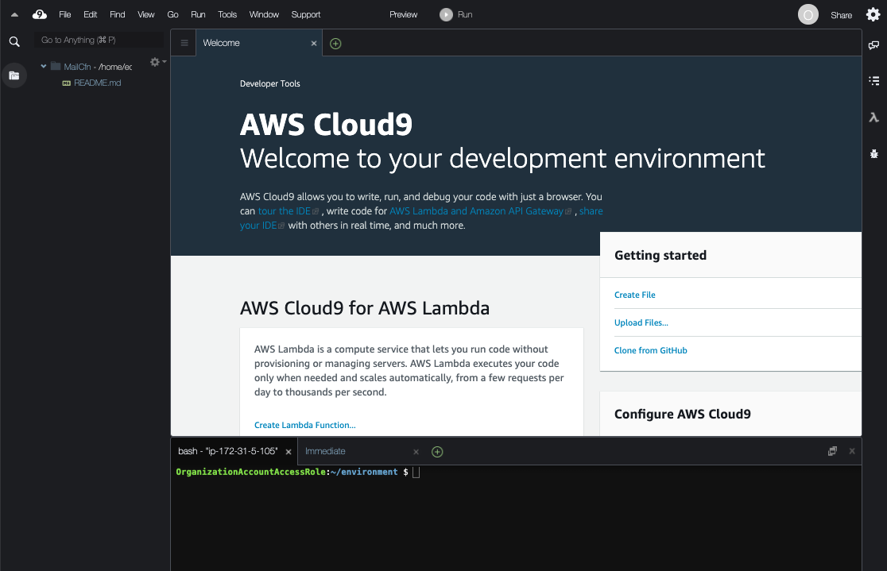

# Glitlab + S3検証
# 検証概要

https://docs.gitlab.com/ee/install/aws/

# 作成手順
## (1)事前設定
### (1)-(a) 作業環境の準備
下記を準備します。もしCLI実行環境がない場合は、次の(1)-(b)を参照し、Cloud9の環境を準備して実行します。
* bashが利用可能な環境(LinuxやMacの環境)
* aws-cliのセットアップ
* AdministratorAccessポリシーが付与され実行可能な、aws-cliのProfileの設定

### (1)-(b) (Option) Cloud9環境準備
Cloud9利用のためには、インターネット経由でCloud9用の絵c2インスタンスにhttpsでアクセス可能である必要があります。
#### (i) Cloud9インスタンスの作成
+ マネージメントコンソールに、AdministratorAccess権限のあるユーザでログインします。
+ サービスから<code>AWS Cloud9</code>に移動します。
+ <code>Create environment</code>ボタンを押します。
+ Name environment
  + NameとDescriptionに任意の情報を入れます。
+ Environment settings  *デフォルトのままでOKですが、念の為記載します。
  + Environment type: <code>Create a new EC2 instance for environment (direct access)</code>を選択
  + Instance type: <code>t2.micro (1 GiB RAM + 1 vCPU)</code>を選択
  + Platform: <code>Amazon Linux</code>
+ Network settings (advanced):
  + デフォルトでは、デフォルトVPCにデプロイされます。基本そのままにします。
+ 設定内容確認
  + 設定内容を確認し、<code>Create environment</code>を実行。
#### (ii) Cloud9環境のアクセスと環境の確認
インスタンスが作成されると、下記のようなCloud9の操作画面がブラウザに表示されます。
以後は、右下のコマンドラインで作業を行います。(画面が小さい場合はコマンドラインを上に拡大することが可能です。)



#### (iii) AWS CLIの実行確認 
コマンドラインで、aws CLIが利用できることを確認します。stsコマンドで、実行に利用するセッション情報が表示できることを確認します。以下の形式でCloud9のインスタンスを作成したユーザの権限情報が表示されれば成功です。

```shell
aws sts get-caller-identity
{
    "UserId": "XXXXXXX:XXXXXX",
    "Account": "999999999999",
    "Arn": "arn:aws:sts::999999999999:XXXXXXX/XXXXXX"
}
```
### (1)-(b) 環境作成用ファイルのClone
この構築用のファイル一式を実行環境で展開します。

#### (i) git clone
下記コマンドで検証用資材をgit cloneします。
```shell
git clone https://github.com/Noppy/gitlab-and-s3-PoC.git
cd gitlab-and-s3-PoC/
```
### (1)-(c) CLI実行用の事前準備
これ以降のAWS-CLIで共通で利用するパラメータを環境変数で設定しておきます。
```shell
export PROFILE=default #aa#デフォルト以外のプロファイルの場合は、利用したいプロファイル名を指定
export REGION=$(aws --profile ${PROFILE} configure get region)
echo "${PROFILE}  ${REGION}"
```

## (2)ネットワーク環境の作成(CloudFormation利用)
gitコマンド用のクライアントVPC(ClientVPC)、gitlab用VPC(GitlabVPC)を作成しTransit Gatewayで接続します。(VPC接続は、VPC Peeringでも可能)
なお、CloudFormationの進捗状況は、別途マネージメントコンソールの画面をだしCloudFormationのスタックを表示するとわかりやすいです。


### (2)-(a) ClientVPC作成
```shell
#ClientVPC
CFN_STACK_PARAMETERS='
[
  {
    "ParameterKey": "DnsHostnames",
    "ParameterValue": "true"
  },
  {
    "ParameterKey": "DnsSupport",
    "ParameterValue": "true"
  },
  {
    "ParameterKey": "InternetAccess",
    "ParameterValue": "true"
  },
  {
    "ParameterKey": "EnableNatGW",
    "ParameterValue": "false"
  },
  {
    "ParameterKey": "VpcInternalDnsNameEnable",
    "ParameterValue": "false"
  },
  {
    "ParameterKey": "VpcName",
    "ParameterValue": "ClientVPC"
  },
  {
    "ParameterKey": "VpcCidr",
    "ParameterValue": "10.1.0.0/16"
  },
  {
    "ParameterKey": "PublicSubnet1Name",
    "ParameterValue": "PubSub1"
  },
  {
    "ParameterKey": "PublicSubnet1Cidr",
    "ParameterValue": "10.1.0.0/19"
  },
  {
    "ParameterKey": "PublicSubnet2Name",
    "ParameterValue": "PubSub2"
  },
  {
    "ParameterKey": "PublicSubnet2Cidr",
    "ParameterValue": "10.1.32.0/19"
  },
  {
    "ParameterKey": "PrivateSubnet1Name",
    "ParameterValue": "PrivateSub1"
  },
  {
    "ParameterKey": "PrivateSubnet1Cidr",
    "ParameterValue": "10.1.128.0/19"
  },
  {
    "ParameterKey": "PrivateSubnet2Name",
    "ParameterValue": "PrivateSub2"
  },
  {
    "ParameterKey": "PrivateSubnet2Cidr",
    "ParameterValue": "10.1.160.0/19"
  }
]'
aws --profile ${PROFILE} cloudformation create-stack \
    --stack-name GitlabS3PoC-ClientVPC \
    --template-body "file://./cfns/vpc-4subnets.yaml" \
    --parameters "${CFN_STACK_PARAMETERS}" \
    --capabilities CAPABILITY_IAM ;
```
### (2)-(b) GitlabVPC作成
```shell
# GitlabVPC
CFN_STACK_PARAMETERS='
[
  {
    "ParameterKey": "DnsHostnames",
    "ParameterValue": "true"
  },
  {
    "ParameterKey": "DnsSupport",
    "ParameterValue": "true"
  },
  {
    "ParameterKey": "InternetAccess",
    "ParameterValue": "false"
  },
  {
    "ParameterKey": "EnableNatGW",
    "ParameterValue": "false"
  },
  {
    "ParameterKey": "VpcInternalDnsNameEnable",
    "ParameterValue": "false"
  },
  {
    "ParameterKey": "VpcName",
    "ParameterValue": "GitlabVPC"
  },
  {
    "ParameterKey": "VpcCidr",
    "ParameterValue": "10.2.0.0/16"
  },
  {
    "ParameterKey": "PublicSubnet1Name",
    "ParameterValue": "TgwSub1"
  },
  {
    "ParameterKey": "PublicSubnet1Cidr",
    "ParameterValue": "10.2.0.0/19"
  },
  {
    "ParameterKey": "PublicSubnet2Name",
    "ParameterValue": "TgwSub2"
  },
  {
    "ParameterKey": "PublicSubnet2Cidr",
    "ParameterValue": "10.2.32.0/19"
  },
  {
    "ParameterKey": "PrivateSubnet1Name",
    "ParameterValue": "gitlabSub1"
  },
  {
    "ParameterKey": "PrivateSubnet1Cidr",
    "ParameterValue": "10.2.128.0/19"
  },
  {
    "ParameterKey": "PrivateSubnet2Name",
    "ParameterValue": "gitlabSub2"
  },
  {
    "ParameterKey": "PrivateSubnet2Cidr",
    "ParameterValue": "10.2.160.0/19"
  }
]'

aws --profile ${PROFILE} cloudformation create-stack \
    --stack-name GitlabS3PoC-GitlabVPC  \
    --template-body "file://./cfns/vpc-4subnets.yaml" \
    --parameters "${CFN_STACK_PARAMETERS}" \
    --capabilities CAPABILITY_IAM ;
```
### (2)-(c) TransitGateway接続(CloudFormation利用)

```shell
aws --profile ${PROFILE} cloudformation create-stack \
    --stack-name GitlabS3PoC-TGW \
    --template-body "file://./cfns/tgw.yaml" ;
```
### (2)-(d) ClientVPC VPCE作成
ClientVPCにて、Private Subnet上からAmazon Linux2のyumアップデートが可能となるよう、Amazon Linux2のyumリポジトリ用バケットへのアクセスのみ許可したS3のVPECエンドポイントを作成します。
```shell
# Internal-VPCへのVPCE作成
aws --profile ${PROFILE} cloudformation create-stack \
    --stack-name GitlabS3PoC-ClientVPC-VPCE \
    --template-body "file://./cfns/vpce_s3_clientvpc.yaml" ;
```

## (3) Security Group作成(CloudFormation利用)
EC2インスタンスに適用するSecurityGroupを作成します。
```shell
RDP_CIDR="27.0.0.0/8"

CFN_STACK_PARAMETERS='
[
  {
    "ParameterKey": "AllowRpdCidr",
    "ParameterValue": "'"${RDP_CIDR}"'"
  }
]'
aws --profile ${PROFILE} cloudformation create-stack \
    --stack-name GitlabS3PoC-SecurityGroups \
    --template-body "file://./cfns/sg.yaml" ;
```

## (4) Gitlab用S3バケットとVPCE作成(CloudFormation利用)
Gitlab用のS3バケットとGitLabVPCにVPCEを作成します。
Gitlab用のS3バケットは、GitLabVPCのVPCEからのアクセスのみ許可します。
GitLabVPCにVPCEは、Gitlab用のS3バケットとAmazon Linux2のyumリポジトリアクセスのみ許可します。
```shell
aws --profile ${PROFILE} cloudformation create-stack \
    --stack-name GitlabS3PoC-S3 \
    --template-body "file://./cfns/s3.yaml" ;
```
## (5) IAMロール作成

```shell
aws --profile ${PROFILE} cloudformation create-stack \
    --stack-name GitlabS3PoC-Iam \
    --template-body "file://./cfns/iam.yaml" \
    --capabilities CAPABILITY_IAM ;
```
## (5) Linuxクライアントインスタンスの作成
### (5)-(a) 情報設定
```shell
KEYNAME="CHANGE_KEY_PAIR_NAME"  #環境に合わせてキーペア名を設定してください。 
AL2_AMIID=$(aws --profile ${PROFILE} --output text \
    ec2 describe-images \
        --owners amazon \
        --filters 'Name=name,Values=amzn2-ami-hvm-2.0.????????.?-x86_64-gp2' \
                  'Name=state,Values=available' \
        --query 'reverse(sort_by(Images, &CreationDate))[:1].ImageId' ) ;
echo -e "KEYNAME   = ${KEYNAME}\nAL2_AMIID = ${AL2_AMIID}"
```
### (5)-(b) Bastionインスタンス作成
```shell
# Set Stack Parameters
CFN_STACK_PARAMETERS='
[
  {
    "ParameterKey": "AmiId",
    "ParameterValue": "'"${AL2_AMIID}"'"
  },
  {
    "ParameterKey": "KEYNAME",
    "ParameterValue": "'"${KEYNAME}"'"
  }
]'
# Create Bastion

aws --profile ${PROFILE} cloudformation create-stack \
    --stack-name GitlabS3PoC-Bastion  \
    --template-body "file://./cfns/bastion.yaml" \
    --parameters "${CFN_STACK_PARAMETERS}";
```
### (5)-(c) Clientインスタンス作成
```shell
# Set Stack Parameters
CFN_STACK_PARAMETERS='
[
  {
    "ParameterKey": "AmiId",
    "ParameterValue": "'"${AL2_AMIID}"'"
  },
  {
    "ParameterKey": "KEYNAME",
    "ParameterValue": "'"${KEYNAME}"'"
  }
]'
# Create Bastion

aws --profile ${PROFILE} cloudformation create-stack \
    --stack-name GitlabS3PoC-Client  \
    --template-body "file://./cfns/client.yaml" \
    --parameters "${CFN_STACK_PARAMETERS}";
```
### (5)-(d) ログイン確認とClientへのgitインストール
別ターミナルを起動し下記を実行して作成したインスタンスにログイン可能かを確認します。
```shell
#別ターミナルを起動し下記を実行

#初期化
export PROFILE=default #aa#デフォルト以外のプロファイルの場合は、利用したいプロファイル名を指定
export REGION=$(aws --profile ${PROFILE} configure get region)
echo "${PROFILE}  ${REGION}"

#BastionのPublic IP取得
BastionIP=$(aws --profile ${PROFILE} --output text \
    cloudformation describe-stacks \
        --stack-name GitlabS3PoC-Bastion \
        --query 'Stacks[].Outputs[?OutputKey==`InstancePublicIp`].[OutputValue]')
echo "BastionIP = ${BastionIP}"

#Bastionにログイン
ssh-add
ssh -A ec2-user@${BastionIP}
```
Bastionにログインしたら初期化処理を行います。
```shell
# AWS cli初期設定
Region=$(curl -s http://169.254.169.254/latest/meta-data/placement/availability-zone | sed -e 's/.$//')
aws configure set region ${Region}
aws configure set output json

#動作確認
aws sts get-caller-identity

#利用するプロファイル設定
export PROFILE=default
```
git Clientへのアクセス確認を行います。
```shell
#ClientのPublic IP取得
ClientIP=$(aws --profile ${PROFILE} --output text \
    cloudformation describe-stacks \
        --stack-name GitlabS3PoC-Client \
        --query 'Stacks[].Outputs[?OutputKey==`InstancePrivateIp`].[OutputValue]')
echo "ClientIP = ${ClientIP}"

#Clientにログイン
ssh -A ec2-user@${ClientIP}
```
Clientにログインできたいら、gitをインストールする
```shell
#gitをインストール
sudo yum -y install git
```

## (6) Windowsクライアントインスタンスの作成
元のCloudFormationの作業を行っていたターミナルに戻り、Windowsの踏み台をClientを作成する
### (6)-(a) 情報設定
```shell
KEYNAME="CHANGE_KEY_PAIR_NAME"  #環境に合わせてキーペア名を設定してください。 
WIN2019_AMIID=$(aws --profile ${PROFILE} --output text \
    ec2 describe-images \
        --owners amazon \
        --filters 'Name=name,Values=Windows_Server-2019-Japanese-Full-Base-????.??.??' \
                  'Name=state,Values=available' \
        --query 'reverse(sort_by(Images, &CreationDate))[:1].ImageId' ) ;
echo -e "KEYNAME   = ${KEYNAME}\nAL2_AMIID = ${WIN2019_AMIID}"
```
### (6)-(b) Windows Bastion
```shell
# Set Stack Parameters
CFN_STACK_PARAMETERS='
[
  {
    "ParameterKey": "AmiId",
    "ParameterValue": "'"${WIN2019_AMIID}"'"
  },
  {
    "ParameterKey": "KEYNAME",
    "ParameterValue": "'"${KEYNAME}"'"
  }
]'
# Create Bastion
aws --profile ${PROFILE} cloudformation create-stack \
    --stack-name GitlabS3PoC-BastionWin  \
    --template-body "file://./cfns/bastion.yaml" \
    --parameters "${CFN_STACK_PARAMETERS}";
```
### (6)-(c) Windows Client
```shell
# Set Stack Parameters
CFN_STACK_PARAMETERS='
[
  {
    "ParameterKey": "AmiId",
    "ParameterValue": "'"${WIN2019_AMIID}"'"
  },
  {
    "ParameterKey": "KEYNAME",
    "ParameterValue": "'"${KEYNAME}"'"
  }
]'
# Create Bastion
aws --profile ${PROFILE} cloudformation create-stack \
    --stack-name GitlabS3PoC-ClientWin  \
    --template-body "file://./cfns/client.yaml" \
    --parameters "${CFN_STACK_PARAMETERS}";
```
### (6)-(d)セットアップ
- BastionにRDPでログインする。
- ClientにRDPログインする。
- ClientにRDPをセットアップする
  - Linux BastionでCrhomをダウンロードする
  ```shell
  curl -OL https://dl.google.com/tag/s/appguid%3D%7B8A69D345-D564-463C-AFF1-A69D9E530F96%7D%26iid%3D%7BF562C505-772C-7993-3E76-C49E22834DC7%7D%26lang%3Den%26browser%3D4%26usagestats%3D0%26appname%3DGoogle%2520Chrome%26needsadmin%3Dtrue%26ap%3Dx64-stable-statsdef_0%26brand%3DGCEB/dl/chrome/install/GoogleChromeEnterpriseBundle64.zip
  ```
  - Windows Clientに移動しsshログインをセットアップする
  ```ps
  mkdir .ssh
  cd .ssh
  notepad id_rsa
  <メモ帳が開いたら秘密鍵を設定して保存する>

  notepad config
  <メモ帳が開いたら下記を設定する>
  Host hoge
    HostName <BastionLinuxのPrivateIP>
    port 22
    User ec2-user
    Protocol 2
    IdentityFile C:\Users\Administrator\.ssh\id_rsa
  ```
  - Basion LinuxからChromをscpで取得する
  ```ps
   scp ec2-user@10.1.30.232:/home/ec2-user/GoogleChromeEnterpriseBundle64.zip .
  ```
  - zipを解凍して、Installersの<code>GoogleChromeStandaloneEnterprise64</code>でchromをセットアップをする


## (7) Gitlabセットアップ
### (7)-(a) Gitlabインスタンスの作成
元のCloudFormationの作業を行っていたターミナルに戻り、Gitlabのインスタンスを作成します。
手順は、https://docs.gitlab.com/ee/install/aws/を参考にしています。
### (6)-(b) RDSセットアップ
gitlab用のRDS(PostgreSQL)をセットアップします。
```shell
aws --profile ${PROFILE} cloudformation create-stack \
    --stack-name GitlabS3PoC-Rds  \
    --template-body "file://./cfns/rds.yaml";
```


### (6)-(a) 情報設定
```shell
KEYNAME="CHANGE_KEY_PAIR_NAME"  #環境に合わせてキーペア名を設定してください。  
INSTANCE_TYPE="t2.micro"        #インスタンスタイプ設定

#最新のAmazon Linux2のAMI IDを取得します。
AL2_AMIID=$(aws --profile ${PROFILE} --output text \
    ec2 describe-images \
        --owners amazon \
        --filters 'Name=name,Values=amzn2-ami-hvm-2.0.????????.?-x86_64-gp2' \
                  'Name=state,Values=available' \
        --query 'reverse(sort_by(Images, &CreationDate))[:1].ImageId' ) ;
echo -e "KEYNAME      = ${KEYNAME}\nINSTANCE_TYPE= ${INSTANCE_TYPE}\nAL2_AMIID    = ${AL2_AMIID}"

# VPC,SG情報取得
PubSub1Id=$(aws --profile ${PROFILE} --output text \
    cloudformation describe-stacks \
        --stack-name GitlabS3PoC-ClientVPC \
        --query 'Stacks[].Outputs[?OutputKey==`PublicSubnet1Id`].[OutputValue]')
PrivateSub1Id=$(aws --profile ${PROFILE} --output text \
    cloudformation describe-stacks \
        --stack-name GitlabS3PoC-ClientVPC \
        --query 'Stacks[].Outputs[?OutputKey==`PrivateSubnet1Id`].[OutputValue]')
SG_ID=$(aws --profile ${PROFILE} --output text \
    cloudformation describe-stacks \
        --stack-name GitlabS3PoC-SecurityGroups \
        --query 'Stacks[].Outputs[?OutputKey==`ClientSGId`].[OutputValue]')

echo -e "PubSub1Id    = $PubSub1Id\nPrivateSub1Id= $PrivateSub1Id\nSG_ID        = ${SG_ID}"
```
### (5)-(b) Bastionサーバ
```shell
#タグ設定
TAGJSON='
[
    {
        "ResourceType": "instance",
        "Tags": [
            {
                "Key": "Name",
                "Value": "GitlabPoC-Bastion"
            }
        ]
    }
]'

#ユーザデータ設定
USER_DATA='
#!/bin/bash -xe
                
yum -y update
hostnamectl set-hostname ECSWorker-Bastion
'
# サーバの起動
aws --profile ${PROFILE} --no-cli-pager \
    ec2 run-instances \
        --image-id ${AL2_AMIID} \
        --instance-type ${INSTANCE_TYPE} \
        --key-name ${KEYNAME} \
        --subnet-id ${PubSub1Id} \
        --security-group-ids ${SG_ID} \
        --associate-public-ip-address \
        --tag-specifications "${TAGJSON}" \
        --user-data "${USER_DATA}";
```


## (6) バッチ・リレーメールインスタンスの準備
バッチ用インスタンス、およびリレーメール用インスタンスの共通設定を行います。
### (6)-(a) インスタンスロール作成 (CloudFormation利用)
```shell
aws --profile ${PROFILE} cloudformation create-stack \
    --stack-name MailPoC-IAM-For-Instance \
    --template-body "file://./cfn/iam-relaymail.yaml" \
    --capabilities CAPABILITY_NAMED_IAM ;
```
### (6)-(b)共通のパラメータ設定 
ここで必ず、検証で外部からSubmissionPortにメール送信する時に利用する環境のパブリックIPを<code>NETWORK_FOR_SEMD_MAIL</code>に指定してください。また、利用するキーペアを<code>KEYNAME</code>に設定して下さい。
```shell
NETWORK_FOR_SEMD_MAIL="<<検証時の外部クライアントのIPをCIDRで記載>>"
POSTFIX_MYNETWORK="127.0.0.1, 10.0.0.0/8"
POSTFIX_MYNETWORK_INBOUND="${POSTFIX_MYNETWORK},${NETWORK_FOR_SEMD_MAIL}"

KEYNAME="CHANGE_KEY_PAIR_NAME"  #環境に合わせてキーペア名を設定してください。  

#最新のAmazon Linux2のAMI IDを取得します。
AL2_AMIID=$(aws --profile ${PROFILE} --output text \
    ec2 describe-images \
        --owners amazon \
        --filters 'Name=name,Values=amzn2-ami-hvm-2.0.????????.?-x86_64-gp2' \
                  'Name=state,Values=available' \
        --query 'reverse(sort_by(Images, &CreationDate))[:1].ImageId' ) ;
echo -e "POSTFIX_MYNETWORK_INBOUND=${POSTFIX_MYNETWORK_INBOUND}\nKEYNAME=${KEYNAME}\nAL2_AMIID=${AL2_AMIID}"
```
## (7)リレーメールインスタンス
### (6)-(a) (Option)Gmail接続用のパスワードのStore
検証でGmailに接続するためのユーザIDとパスワードを安全に管理するため、System ManagerのParameter storeに格納します。<code>GMAIL_SASL_INFO</code>にPostfixで定義する形式でGmailの認証情報を設定します。Gmailの認証はユーザとパスワードですが、パスワードはアプリケーション用のパスワードをgoogleで払い出して設定するようにします。

```shell
# GMAILの接続用の認証情報の設定
# username@gmail:passwordに、アカウント名とgoogleで払い出したアプリパスワードを設定します。
GMAIL_SASL_INFO="[smtp.gmail.com]:587 username@gmail:password"

# Parameter storeのPut
aws --profile ${PROFILE} \
  ssm put-parameter \
    --name "mail-poc-gmail-sals-info" \
    --value "${GMAIL_SASL_INFO}" \
    --type SecureString \
    --tags "Key=Name,Value=mail-poc-gmail-sals-info"
```

### (7)-(b) OutboundのRelayMailインスタンス作成 (CloudFormation利用)

```shell
CFN_STACK_PARAMETERS='
[
  {
    "ParameterKey": "KeyName",
    "ParameterValue": "'"${KEYNAME}"'"
  },
  {
    "ParameterKey": "AmiId",
    "ParameterValue": "'"${AL2_AMIID}"'"
  },
  {
    "ParameterKey": "PostfixMynetwork",
    "ParameterValue": "'"${POSTFIX_MYNETWORK}"'"
  }
]'

aws --profile ${PROFILE} cloudformation create-stack \
    --stack-name MailPoC-Outbound-RelayMail-Instance \
    --parameters "${CFN_STACK_PARAMETERS}" \
    --template-body "file://./cfn/relaymail-outbound.yaml" \
    --capabilities CAPABILITY_NAMED_IAM ;
```

## (8) バッチインスタンス作成(CloudFormation利用)

```shell
CFN_STACK_PARAMETERS='
[
  {
    "ParameterKey": "KeyName",
    "ParameterValue": "'"${KEYNAME}"'"
  },
  {
    "ParameterKey": "AmiId",
    "ParameterValue": "'"${AL2_AMIID}"'"
  },
  {
    "ParameterKey": "PostfixMynetwork",
    "ParameterValue": "'"${POSTFIX_MYNETWORK}"'"
  }
]'
aws --profile ${PROFILE} cloudformation create-stack \
    --stack-name MailPoC-Batch-Instance \
    --parameters "${CFN_STACK_PARAMETERS}" \
    --template-body "file://./cfn/batch.yaml" \
    --capabilities CAPABILITY_NAMED_IAM ;
```
## (9) InboundのRelayMailインスタンス作成 (CloudFormation利用)

```shell
CFN_STACK_PARAMETERS='
[
  {
    "ParameterKey": "KeyName",
    "ParameterValue": "'"${KEYNAME}"'"
  },
  {
    "ParameterKey": "AmiId",
    "ParameterValue": "'"${AL2_AMIID}"'"
  },
  {
    "ParameterKey": "PostfixMynetwork",
    "ParameterValue": "'"${POSTFIX_MYNETWORK_INBOUND}"'"
  }
]'
aws --profile ${PROFILE} cloudformation create-stack \
    --stack-name MailPoC-Inbound-RelayMail-Instance \
    --parameters "${CFN_STACK_PARAMETERS}" \
    --template-body "file://./cfn/relaymail-inbound.yaml" \
    --capabilities CAPABILITY_NAMED_IAM ;
```


## (10) テスト
### (10)-(a)メール送信テスト
バッチインスタンスにSystems Manager Session Managerでアクセスし、メール送信のテストをします。
#### (i)Systems Manager Session Managerによるバッチインスタンスアクセス
+ マネージメントコンソールで、Systems Managerのサービスを開く
+ 左側のナビゲーションペインから<code>セッションマネージャー</code>を開く
+ <code>セッションを開始する</code>をクリックし、次の画面でリストから<code>MailPoC-InternalVPC-Batch</code>を選び、右上の<code>セッションを開始する</code>
#### (ii)コマンドによるメール送信
```shell
sudo -i -u ec2-user
To_Address="xxxxxx@xxxxxxx.com" #Gmailからのメール受信が可能なアドレスに変更する

Subject="TestMail-$(date '+%Y%m%d%H%M%S')"
SMTP="smtp=smtp://outbound-relaymail.mailpoc.local:587"
From_Address="xxx"


echo "テストメール$(date '+%Y%m%d%H%M%S')" | mail -s $Subject -S $SMTP -r $From_Address $To_Address
```

### (10)-(b)メール受信テスト
#### (i) Cloud9(構築実行環境)からのメール送信
```shell
#ローカールでのmail送信テスト用にmailコマンドをインストール
sudo yum -y install mailx

#InboundのNLBのURLを取得
NLB_DNS=$(aws --profile ${PROFILE} --output text \
    cloudformation describe-stacks \
        --stack-name MailPoC-Inbound-RelayMail-Instance \
        --query 'Stacks[].Outputs[?OutputKey==`InboundRelaymailNlbDns`].[OutputValue]')

echo -e "NLB_DNS= $NLB_DNS"


#メール送信
Subject="TestMail-$(date '+%Y%m%d%H%M%S')"
SMTP="smtp=smtp://${NLB_DNS}:587"
From_Address="xxx"
To_Address="ec2-user@mailpoc.pub"

echo "テストメール$(date '+%Y%m%d%H%M%S')" | mail -s $Subject -S $SMTP -r $From_Address $To_Address
```
#### (ii)バッチインスタンスでのメール受信確認
ec2-userにて、mailコマンドを実行しメールが受信されていることを確認します。
```shell
mail
Heirloom Mail version 12.5 7/5/10.  Type ? for help.
"/var/spool/mail/ec2-user": 1 message 1 new
>N  1 xxx                   Mon Sep 14 11:24  21/968   "TestMail-20200914112456"
&
```