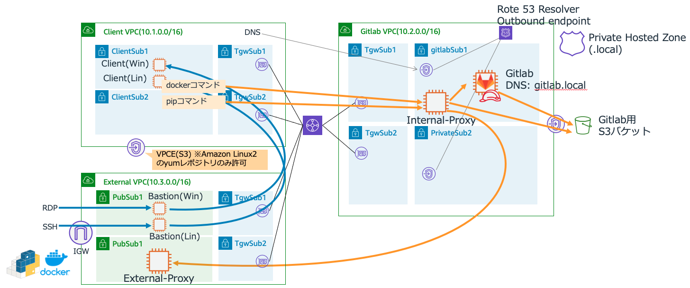
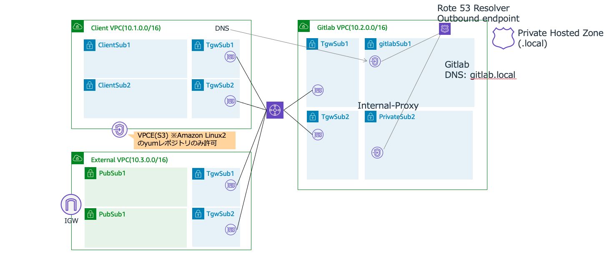
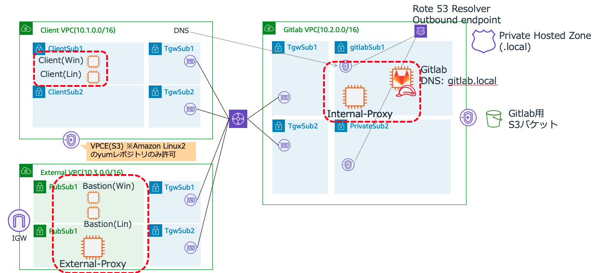

# Glitlab + S3検証
# 作成する構成


# 作成手順
## (1)事前設定
### (1)-(a) 作業環境の準備
下記を準備します。もしCLI実行環境がない場合は、次の(1)-(b)を参照し、Cloud9の環境を準備して実行します。
* bashが利用可能な環境(LinuxやMacの環境)
* aws-cliのセットアップ
* AdministratorAccessポリシーが付与され実行可能な、aws-cliのProfileの設定

### (1)-(b) (Option) Cloud9環境準備
Cloud9利用のためには、インターネット経由でCloud9用のEC2インスタンスにhttpsでアクセス可能である必要があります。
#### (i) Cloud9インスタンスの作成
+ マネージメントコンソールに、AdministratorAccess権限のあるユーザでログインします。
+ サービスから<code>AWS Cloud9</code>に移動します。
+ <code>Create environment</code>ボタンを押します。
+ Name environment
  + NameとDescriptionに任意の情報を入れます。
+ Environment settings  *デフォルトのままでOKですが、念の為記載します。
  + Environment type: <code>Create a new EC2 instance for environment (direct access)</code>を選択
  + Instance type: <code>t2.micro (1 GiB RAM + 1 vCPU)</code>を選択
  + Platform: <code>Amazon Linux</code>
+ Network settings (advanced):
  + デフォルトでは、デフォルトVPCにデプロイされます。基本そのままにします。
+ 設定内容確認
  + 設定内容を確認し、<code>Create environment</code>を実行。
#### (ii) Cloud9環境のアクセスと環境の確認
インスタンスが作成されると、下記のようなCloud9の操作画面がブラウザに表示されます。
以後は、右下のコマンドラインで作業を行います。(画面が小さい場合はコマンドラインを上に拡大することが可能です。)


#### (iii) AWS CLIの実行確認 
コマンドラインで、aws CLIが利用できることを確認します。stsコマンドで、実行に利用するセッション情報が表示できることを確認します。以下の形式でCloud9のインスタンスを作成したユーザの権限情報が表示されれば成功です。

```shell
aws sts get-caller-identity
{
    "UserId": "XXXXXXX:XXXXXX",
    "Account": "999999999999",
    "Arn": "arn:aws:sts::999999999999:XXXXXXX/XXXXXX"
}
```
### (1)-(b) 環境作成用ファイルのClone
この構築用のファイル一式を実行環境で展開します。

#### (i) git clone
下記コマンドで検証用資材をgit cloneします。
```shell
git clone https://github.com/Noppy/gitlab-and-s3-PoC.git
cd gitlab-and-s3-PoC/
```
### (1)-(c) CLI実行用の事前準備
これ以降のAWS-CLIで共通で利用するパラメータを環境変数で設定しておきます。
```shell
export PROFILE=default #aa#デフォルト以外のプロファイルの場合は、利用したいプロファイル名を指定
export REGION=$(aws --profile ${PROFILE} configure get region)
echo "${PROFILE}  ${REGION}"
```

## (2)ネットワーク環境の作成(CloudFormation利用)
gitコマンド用のクライアントVPC(ClientVPC)、gitlab用VPC(GitlabVPC)を作成しTransit Gatewayで接続します。(VPC接続は、VPC Peeringでも可能)
なお、CloudFormationの進捗状況は、別途マネージメントコンソールの画面をだしCloudFormationのスタックを表示するとわかりやすいです。


### (2)-(a) GitlabVPC作成
```shell
# GitlabVPC
CFN_STACK_PARAMETERS='
[
  {
    "ParameterKey": "InternetAccess",
    "ParameterValue": "false"
  },
  {
    "ParameterKey": "EnableNatGW",
    "ParameterValue": "false"
  },
  {
    "ParameterKey": "VpcInternalDnsNameEnable",
    "ParameterValue": "true"
  },
  {
    "ParameterKey": "VpcInternalDnsName",
    "ParameterValue": "local."
  },
  {
    "ParameterKey": "VpcName",
    "ParameterValue": "GitlabVPC"
  },
  {
    "ParameterKey": "VpcCidr",
    "ParameterValue": "10.2.0.0/16"
  },
  {
    "ParameterKey": "PublicSubnet1Name",
    "ParameterValue": "TgwSub1"
  },
  {
    "ParameterKey": "PublicSubnet1Cidr",
    "ParameterValue": "10.2.0.0/19"
  },
  {
    "ParameterKey": "PublicSubnet2Name",
    "ParameterValue": "TgwSub2"
  },
  {
    "ParameterKey": "PublicSubnet2Cidr",
    "ParameterValue": "10.2.32.0/19"
  },
  {
    "ParameterKey": "PrivateSubnet1Name",
    "ParameterValue": "gitlabSub1"
  },
  {
    "ParameterKey": "PrivateSubnet1Cidr",
    "ParameterValue": "10.2.128.0/19"
  },
  {
    "ParameterKey": "PrivateSubnet2Name",
    "ParameterValue": "gitlabSub2"
  },
  {
    "ParameterKey": "PrivateSubnet2Cidr",
    "ParameterValue": "10.2.160.0/19"
  }
]'

aws --profile ${PROFILE} cloudformation create-stack \
    --stack-name GitlabS3PoC-GitlabVPC  \
    --template-body "file://./cfns/vpc-4subnets.yaml" \
    --parameters "${CFN_STACK_PARAMETERS}" \
    --capabilities CAPABILITY_IAM ;
```
### (2)-(b) GitlabVPCのResolver OutboundEndpoint作成
```shell
aws --profile ${PROFILE} cloudformation create-stack \
    --stack-name GitlabS3PoC-GitlabVPCResolverEndpoint  \
    --template-body "file://./cfns/Route53ResolverEndpoint.yaml";
```

### (2)-(c) ClientVPC作成
```shell
# GitlabVPCのOutbound Endpointの情報取得
InboundEndpointId=$(aws --profile ${PROFILE} --output text \
    cloudformation describe-stacks \
        --stack-name GitlabS3PoC-GitlabVPCResolverEndpoint \
        --query 'Stacks[].Outputs[?OutputKey==`ResolverInboundEndpointEndpointId`].[OutputValue]')

declare -a DnsIps=($(aws --profile ${PROFILE} --output text \
    route53resolver list-resolver-endpoint-ip-addresses \
      --resolver-endpoint-id ${InboundEndpointId} \
    --query 'IpAddresses[].Ip' ))
echo -e "InboundEndpointId = ${InboundEndpointId}\nDNS IP(1st) = ${DnsIps[0]}\nDNS IP(2nd) = ${DnsIps[1]}"

#ClientVPC
CFN_STACK_PARAMETERS='
[
  {
    "ParameterKey": "InternetAccess",
    "ParameterValue": "false"
  },
  {
    "ParameterKey": "EnableNatGW",
    "ParameterValue": "false"
  },
  {
    "ParameterKey": "VpcInternalDnsNameEnable",
    "ParameterValue": "false"
  },
  {
    "ParameterKey": "VpcName",
    "ParameterValue": "ClientVPC"
  },
  {
    "ParameterKey": "DhcpOptionsDomainNameServers1",
    "ParameterValue": "'"${DnsIps[0]}"'"
  },
  {
    "ParameterKey": "DhcpOptionsDomainNameServers2",
    "ParameterValue": "'"${DnsIps[1]}"'"
  },
  {
    "ParameterKey": "VpcCidr",
    "ParameterValue": "10.1.0.0/16"
  },
  {
    "ParameterKey": "PublicSubnet1Name",
    "ParameterValue": "TgwSub1"
  },
  {
    "ParameterKey": "PublicSubnet1Cidr",
    "ParameterValue": "10.1.0.0/19"
  },
  {
    "ParameterKey": "PublicSubnet2Name",
    "ParameterValue": "TgwSub1"
  },
  {
    "ParameterKey": "PublicSubnet2Cidr",
    "ParameterValue": "10.1.32.0/19"
  },
  {
    "ParameterKey": "PrivateSubnet1Name",
    "ParameterValue": "ClientSub1"
  },
  {
    "ParameterKey": "PrivateSubnet1Cidr",
    "ParameterValue": "10.1.128.0/19"
  },
  {
    "ParameterKey": "PrivateSubnet2Name",
    "ParameterValue": "ClientSub1"
  },
  {
    "ParameterKey": "PrivateSubnet2Cidr",
    "ParameterValue": "10.1.160.0/19"
  }
]'
aws --profile ${PROFILE} cloudformation create-stack \
    --stack-name GitlabS3PoC-ClientVPC \
    --template-body "file://./cfns/vpc-4subnets.yaml" \
    --parameters "${CFN_STACK_PARAMETERS}" \
    --capabilities CAPABILITY_IAM ;
```

### (2)-(d) ExternalVPC作成
```shell
# GitlabVPC
CFN_STACK_PARAMETERS='
[
  {
    "ParameterKey": "InternetAccess",
    "ParameterValue": "true"
  },
  {
    "ParameterKey": "EnableNatGW",
    "ParameterValue": "false"
  },
  {
    "ParameterKey": "VpcName",
    "ParameterValue": "ExternalVPC"
  },
  {
    "ParameterKey": "VpcCidr",
    "ParameterValue": "10.3.0.0/16"
  },
  {
    "ParameterKey": "PublicSubnet1Name",
    "ParameterValue": "PublicSub1"
  },
  {
    "ParameterKey": "PublicSubnet1Cidr",
    "ParameterValue": "10.3.0.0/19"
  },
  {
    "ParameterKey": "PublicSubnet2Name",
    "ParameterValue": "PublicSub2"
  },
  {
    "ParameterKey": "PublicSubnet2Cidr",
    "ParameterValue": "10.3.32.0/19"
  },
  {
    "ParameterKey": "PrivateSubnet1Name",
    "ParameterValue": "TgwSub1"
  },
  {
    "ParameterKey": "PrivateSubnet1Cidr",
    "ParameterValue": "10.3.128.0/19"
  },
  {
    "ParameterKey": "PrivateSubnet2Name",
    "ParameterValue": "TgwSub2"
  },
  {
    "ParameterKey": "PrivateSubnet2Cidr",
    "ParameterValue": "10.3.160.0/19"
  }
]'

aws --profile ${PROFILE} cloudformation create-stack \
    --stack-name GitlabS3PoC-ExternalVPC  \
    --template-body "file://./cfns/vpc-4subnets.yaml" \
    --parameters "${CFN_STACK_PARAMETERS}" \
    --capabilities CAPABILITY_IAM ;
```
### (2)-(e) TransitGateway接続(CloudFormation利用)
```shell
aws --profile ${PROFILE} cloudformation create-stack \
    --stack-name GitlabS3PoC-TGW \
    --template-body "file://./cfns/tgw.yaml" ;
```


### (2)-(f) VPCE作成(ClientVPC)
ClientVPCにて、Private Subnet上からAmazon Linux2のyumアップデートが可能となるよう、Amazon Linux2のyumリポジトリ用バケットへのアクセスのみ許可したS3のVPECエンドポイントを作成します。
```shell
# Internal-VPCへのVPCE作成
aws --profile ${PROFILE} cloudformation create-stack \
    --stack-name GitlabS3PoC-ClientVPC-VPCE \
    --template-body "file://./cfns/vpce_s3_clientvpc.yaml" ;
```

## (3) Security Group作成(CloudFormation利用)
EC2インスタンスに適用するSecurityGroupを作成します。
```shell
RDP_CIDR="27.0.0.0/8" #RDPのクライアントに合わせて変更

CFN_STACK_PARAMETERS='
[
  {
    "ParameterKey": "AllowRpdCidr",
    "ParameterValue": "'"${RDP_CIDR}"'"
  }
]'
aws --profile ${PROFILE} cloudformation create-stack \
    --stack-name GitlabS3PoC-SecurityGroups \
    --template-body "file://./cfns/sg.yaml" ;
```

## (4) Gitlab用S3バケットとVPCE作成(CloudFormation利用)
Gitlab用のS3バケットとGitLabVPCにVPCEを作成します。
Gitlab用のS3バケットは、GitLabVPCのVPCEからのアクセスのみ許可します。
GitLabVPCにVPCEは、Gitlab用のS3バケットとAmazon Linux2のyumリポジトリアクセスのみ許可します。

```shell
aws --profile ${PROFILE} cloudformation create-stack \
    --stack-name GitlabS3PoC-S3 \
    --template-body "file://./Documnets/s3.yaml" ;
```
## (5) IAMロール作成
```shell
# S3バケット作成のCloudFormationの完了まで待ちます。
aws --profile ${PROFILE} cloudformation wait \
    stack-create-complete \
      --stack-name GitlabS3PoC-S3

#　IAMロール作成
aws --profile ${PROFILE} cloudformation create-stack \
    --stack-name GitlabS3PoC-Iam \
    --template-body "file://./cfns/iam.yaml" \
    --capabilities CAPABILITY_IAM ;
```
## (6) インスタンスセットアップ(Bastion/Proxy/Client/Gitlab)

### (6)-(a) 情報設定
```shell
KEYNAME="CHANGE_KEY_PAIR_NAME"  #環境に合わせてキーペア名を設定してください。 
AL2_AMIID=$(aws --profile ${PROFILE} --output text \
    ec2 describe-images \
        --owners amazon \
        --filters 'Name=name,Values=amzn2-ami-hvm-2.0.????????.?-x86_64-gp2' \
                  'Name=state,Values=available' \
        --query 'reverse(sort_by(Images, &CreationDate))[:1].ImageId' ) ;

WIN2019_AMIID=$(aws --profile ${PROFILE} --output text \
    ec2 describe-images \
        --owners amazon \
        --filters 'Name=name,Values=Windows_Server-2019-Japanese-Full-Base-????.??.??' \
                  'Name=state,Values=available' \
        --query 'reverse(sort_by(Images, &CreationDate))[:1].ImageId' ) ;
echo -e "KEYNAME   = ${KEYNAME}\nAL2_AMIID = ${AL2_AMIID}\nAL2_AMIID = ${WIN2019_AMIID}"
```
### (6)-(b) ExternalVPC Bastion(Linux)インスタンス作成
```shell
# Set Stack Parameters
CFN_STACK_PARAMETERS='
[
  {
    "ParameterKey": "AmiId",
    "ParameterValue": "'"${AL2_AMIID}"'"
  },
  {
    "ParameterKey": "KEYNAME",
    "ParameterValue": "'"${KEYNAME}"'"
  }
]'
# Create Bastion

aws --profile ${PROFILE} cloudformation create-stack \
    --stack-name GitlabS3PoC-Bastion  \
    --template-body "file://./cfns/bastion.yaml" \
    --parameters "${CFN_STACK_PARAMETERS}";
```
### (6)-(c) ExternalVPC Bastion(Windows)インスタンス作成
```shell
# Set Stack Parameters
CFN_STACK_PARAMETERS='
[
  {
    "ParameterKey": "AmiId",
    "ParameterValue": "'"${WIN2019_AMIID}"'"
  },
  {
    "ParameterKey": "KEYNAME",
    "ParameterValue": "'"${KEYNAME}"'"
  }
]'
# Create Bastion
aws --profile ${PROFILE} cloudformation create-stack \
    --stack-name GitlabS3PoC-BastionWin  \
    --template-body "file://./cfns/bastion.yaml" \
    --parameters "${CFN_STACK_PARAMETERS}";
```
### (6)-(d) ExternalVPC ExternalProxyインスタンス作成
- External-Proxy
```shell
# Set Stack Parameters
CFN_STACK_PARAMETERS='
[
  {
    "ParameterKey": "AmiId",
    "ParameterValue": "'"${AL2_AMIID}"'"
  },
  {
    "ParameterKey": "KEYNAME",
    "ParameterValue": "'"${KEYNAME}"'"
  }
]'
# Create External Proxy
aws --profile ${PROFILE} cloudformation create-stack \
    --stack-name GitlabS3PoC-ExternalProxy  \
    --template-body "file://./cfns/external-proxy.yaml" \
    --parameters "${CFN_STACK_PARAMETERS}";
```
### (6)-(e) ClientVPC Client(Linux)作成
```shell
# Set Stack Parameters
CFN_STACK_PARAMETERS='
[
  {
    "ParameterKey": "AmiId",
    "ParameterValue": "'"${AL2_AMIID}"'"
  },
  {
    "ParameterKey": "KEYNAME",
    "ParameterValue": "'"${KEYNAME}"'"
  }
]'
# Create Bastion
aws --profile ${PROFILE} cloudformation create-stack \
    --stack-name GitlabS3PoC-Client  \
    --template-body "file://./cfns/client.yaml" \
    --parameters "${CFN_STACK_PARAMETERS}";
```
### (6)-(f) ClientVPC Client(Windows)作成
```shell
# Set Stack Parameters
CFN_STACK_PARAMETERS='
[
  {
    "ParameterKey": "AmiId",
    "ParameterValue": "'"${WIN2019_AMIID}"'"
  },
  {
    "ParameterKey": "KEYNAME",
    "ParameterValue": "'"${KEYNAME}"'"
  }
]'
# Create Bastion
aws --profile ${PROFILE} cloudformation create-stack \
    --stack-name GitlabS3PoC-ClientWin  \
    --template-body "file://./cfns/client.yaml" \
    --parameters "${CFN_STACK_PARAMETERS}";
```
### (6)-(g) GitlabVPC Gitlabインスタンス作成
```shell
# Set Stack Parameters
CFN_STACK_PARAMETERS='
[
  {
    "ParameterKey": "AmiId",
    "ParameterValue": "'"${AL2_AMIID}"'"
  },
  {
    "ParameterKey": "KEYNAME",
    "ParameterValue": "'"${KEYNAME}"'"
  }
]'
# Create Bastion

aws --profile ${PROFILE} cloudformation create-stack \
    --stack-name GitlabS3PoC-Gitlab  \
    --template-body "file://./cfns/gitlab.yaml" \
    --parameters "${CFN_STACK_PARAMETERS}";
```
### (6)-(h) GitlabVPC Internal-Proxyインスタンス作成
```shell
# Gitlabインスタンス作成完了までのWait
aws --profile ${PROFILE} cloudformation wait \
    stack-create-complete \
      --stack-name GitlabS3PoC-Gitlab

# Set Stack Parameters
CFN_STACK_PARAMETERS='
[
  {
    "ParameterKey": "AmiId",
    "ParameterValue": "'"${AL2_AMIID}"'"
  },
  {
    "ParameterKey": "KEYNAME",
    "ParameterValue": "'"${KEYNAME}"'"
  }
]'
# Create External Proxy
aws --profile ${PROFILE} cloudformation create-stack \
    --stack-name GitlabS3PoC-InternalProxy  \
    --template-body "file://./cfns/Internal-proxy.yaml" \
    --parameters "${CFN_STACK_PARAMETERS}";
```


## (7) OSセットアップ
### (7)-(a) Linuxインスタンスログイン確認
別ターミナルを起動し下記を実行して作成したインスタンスにログイン可能かを確認します。
```shell
#別ターミナルを起動し下記を実行

#初期化
export PROFILE=default #デフォルト以外のプロファイルの場合は、利用したいプロファイル名を指定
export REGION=$(aws --profile ${PROFILE} configure get region)
echo "${PROFILE}  ${REGION}"

#BastionのPublic IP取得
BastionIP=$(aws --profile ${PROFILE} --output text \
    cloudformation describe-stacks \
        --stack-name GitlabS3PoC-Bastion \
        --query 'Stacks[].Outputs[?OutputKey==`InstancePublicIp`].[OutputValue]')
echo "BastionIP = ${BastionIP}"

#Bastionにログイン
ssh-add
ssh -A ec2-user@${BastionIP}
```
Bastionにログインしたら初期化処理を行います。
```shell
# AWS cli初期設定
Region=$(curl -s http://169.254.169.254/latest/meta-data/placement/availability-zone | sed -e 's/.$//')
aws configure set region ${Region}
aws configure set output json

#動作確認
aws sts get-caller-identity
```
各Linuxインスタンスへのアクセスのための情報を設定します。
```shell
#利用するプロファイル設定
export PROFILE=default

#ClientのPrivate IP取得
ClientIP=$(aws --profile ${PROFILE} --output text \
    cloudformation describe-stacks \
        --stack-name GitlabS3PoC-Client \
        --query 'Stacks[].Outputs[?OutputKey==`InstancePrivateIp`].[OutputValue]')
GitlabIP=$(aws --profile ${PROFILE} --output text \
    cloudformation describe-stacks \
        --stack-name GitlabS3PoC-Gitlab \
        --query 'Stacks[].Outputs[?OutputKey==`InstancePrivateIp`].[OutputValue]')
ExternalProxyIP=$(aws --profile ${PROFILE} --output text \
    cloudformation describe-stacks \
        --stack-name GitlabS3PoC-ExternalProxy \
        --query 'Stacks[].Outputs[?OutputKey==`InstancePrivateIp`].[OutputValue]')
InternalProxyIP=$(aws --profile ${PROFILE} --output text \
    cloudformation describe-stacks \
        --stack-name GitlabS3PoC-InternalProxy \
        --query 'Stacks[].Outputs[?OutputKey==`InstancePrivateIp`].[OutputValue]')
echo -e "ClientIP      = ${ClientIP}\nGitlabIP      = ${GitlabIP}\nExternalProxy = ${ExternalProxyIP}\nInternalProxy = ${InternalProxyIP}"
```
各Linuxインスタンスに接続確認します。
```shell
#Clientにログイン
ssh -A ec2-user@${ClientIP}
exit

#Gitlabにログイン
ssh -A ec2-user@${GitlabIP}
exit

#External-Proxyにログイン
ssh -A ec2-user@${ExternalProxyIP}
exit

#Internal-Proxyにログイン
ssh -A ec2-user@${InternalProxyIP}
exit
```
Bastionサーバ上で、External Proxy用の設定ファイルを作成し、各インスタンスに配布します。
```shell
#Proxy設定
cat >> externalproxy_setting << EOL
export HTTP_PROXY=http://${ExternalProxyIP}:3128
export HTTPS_PROXY=http://${ExternalProxyIP}:3128
export NO_PROXY=169.254.169.254
EOL

#設定ファイルの確認
cat externalproxy_setting

#各Linuxインスタンスへの配布
scp externalproxy_setting ec2-user@${ClientIP}:/home/ec2-user/
scp externalproxy_setting ec2-user@${GitlabIP}:/home/ec2-user/
```

### (7)-(b) クライアント(Linux)セットアップ
Client(Linux)にログインする。
```shell
#Bastionサーバ上から下記でClient(Linux)にログイン
ClientIP=$(aws --profile ${PROFILE} --output text \
    cloudformation describe-stacks \
        --stack-name GitlabS3PoC-Client \
        --query 'Stacks[].Outputs[?OutputKey==`InstancePrivateIp`].[OutputValue]')

#Clientにログイン
ssh -A ec2-user@${ClientIP}
```
クライアントログイン後に、git/dockerをインストールする
```shell
#ExternalProxy設定の一時的な取り込み
ls externalproxy_setting  #ファイルがあることを確認

#設定の取り込み
. externalproxy_setting

#AWS CLI初期化
Region=$(curl -s http://169.254.169.254/latest/meta-data/placement/availability-zone | sed -e 's/.$//')
aws configure set region ${Region}
aws configure set output json

#動作確認
aws sts get-caller-identity

#パッケージの最新化
sudo yum -y update

#gitをインストール
sudo yum -y install git

#install docker
sudo amazon-linux-extras install -y docker
sudo service docker start
sudo usermod -a -G docker ec2-user
sudo systemctl enable docker
sudo service docker restart

#Dockerデーモンの状態確認(active (running) 状態であればOK!!)
systemctl status docker

#一旦Clientを終了する
exit
```
### (7)-(c)Windowsセットアップ
- マネコンまたは、先ほどのBastion(Linux)で、External-ProxyのPrivateIPを控える
- BastionにRDPでログインする。
- ClientにRDPログインする。
- ClientにRDPをセットアップする
- Chromeをインストールする
  - PowerShellを起動する
  ```powershell
  $proxy = "http://<External-ProxyのPrivateIP>:3128"
  $url = "https://dl.google.com/tag/s/appguid%3D%7B8A69D345-D564-463C-AFF1-A69D9E530F96%7D%26iid%3D%7BF562C505-772C-7993-3E76-C49E22834DC7%7D%26lang%3Den%26browser%3D4%26usagestats%3D0%26appname%3DGoogle%2520Chrome%26needsadmin%3Dtrue%26ap%3Dx64-stable-statsdef_0%26brand%3DGCEB/dl/chrome/install/GoogleChromeEnterpriseBundle64.zip"
  $output = "GoogleChromeEnterpriseBundle64.zip"
  
  Invoke-WebRequest -Proxy $proxy -Uri $url -OutFile $output

  Expand-Archive -Path　$output

  GoogleChromeEnterpriseBundle64\Installers\GoogleChromeStandaloneEnterprise64.msi
  ```

## (8) Gitlabセットアップ-1 インスタンスのセットアップ
### (8)-(a) Gitlabインスタンスへのログイン
別ターミナルを起動し下記を実行してBastionにログインする。
```shell
#別ターミナルを起動し下記を実行

#初期化
export PROFILE=default #デフォルト以外のプロファイルの場合は、利用したいプロファイル名を指定
export REGION=$(aws --profile ${PROFILE} configure get region)
echo "${PROFILE}  ${REGION}"

#BastionのPublic IP取得
BastionIP=$(aws --profile ${PROFILE} --output text \
    cloudformation describe-stacks \
        --stack-name GitlabS3PoC-Bastion \
        --query 'Stacks[].Outputs[?OutputKey==`InstancePublicIp`].[OutputValue]')
echo "BastionIP = ${BastionIP}"

#Bastionにログイン
ssh-add
ssh -A ec2-user@${BastionIP}
```
Gitlabにログインする
```shell
PROFILE=default
GitlabIP=$(aws --profile ${PROFILE} --output text \
    cloudformation describe-stacks \
        --stack-name GitlabS3PoC-Gitlab \
        --query 'Stacks[].Outputs[?OutputKey==`InstancePrivateIp`].[OutputValue]')
echo -e "GitlabIP      = ${GitlabIP}"

#Gitlabにログイン
ssh -A ec2-user@${GitlabIP}
```
Gitlab環境の初期化を行う
```shell
#AWS CLI初期化
( . ~/externalproxy_setting
Region=$(curl -s http://169.254.169.254/latest/meta-data/placement/availability-zone | sed -e 's/.$//')
aws configure set region ${Region}
aws configure set output json

#動作確認
aws sts get-caller-identity
)

```
### (8)-(b) dockerセットアップ
```shell
#docker setup
sudo yum update -y
sudo amazon-linux-extras install -y docker

sudo service docker start
sudo usermod -a -G docker ec2-user
sudo systemctl enable docker
sudo service docker restart

#Dockerデーモンの状態確認(active (running) 状態であればOK!!)
systemctl status docker

#ec2-userへのグループ追加を反映するためexitして再ログインする
exit
```
dockerグループへの所属を反映させるため再度、Clientからgitlabにログインする。
```shell
ssh -A ec2-user@${GitlabIP}
```
Gitlabインスタンスへログイン後
```shell
#ec2-useからdockerコマンドが実行できることを確認(エラーが出なければOK)
docker ps
```
DockerのProxy設定
```shell
(. externalproxy_setting;
CONFIG='
[Service]
Environment="HTTP_PROXY='"${HTTP_PROXY}"'"
Environment="HTTPS_PROXY='"${HTTP_PROXY}"'"
Environment="NO_PROXY=localhost,127.0.0.1,gitlab.local"
'
sudo mkdir -p /etc/systemd/system/docker.service.d
echo "${CONFIG}" | sudo tee /etc/systemd/system/docker.service.d/http-proxy.conf
)
#設定の確認
cat /etc/systemd/system/docker.service.d/http-proxy.conf

#デーモン再起動
sudo systemctl daemon-reload
sudo systemctl restart docker
```
### (8)-(c) GitLabセットアップ
gitlabのdockerイメージを取得する
```shell
docker pull gitlab/gitlab-ce:13.5.4-ce.0
```
DockerのBridgeネットワーク作成(クライアントからのアクセスを可能にするため)
```shell
docker network create gitlab_bridge
docker network ls
```
Docker用のShared Volumeコンテナ作成
```shell
#Shared Volumeコンテナを作成
docker run \
  --name gitlab-datavol \
  --restart=always \
  --net gitlab_bridge \
  --volume /home/web/docker/gitlab/config:/etc/gitlab:Z \
  --volume /home/web/docker/gitlab/logs:/var/log/gitlab:Z \
  --volume /home/web/docker/gitlab/data:/var/opt/gitlab:Z \
  --volume /home/web/docker/gitlab-runner/config:/etc/gitlab-runner:Z \
-itd alpine:3.12.1

#確認(gitlab-datavolのコンテナが起動していることを確認)
docker ps
```
GitLabコンテナ起動
```shell
bash
. ~/externalproxy_setting;

#情報取得
PROFILE=default
Region=$(curl -s http://169.254.169.254/latest/meta-data/placement/availability-zone | sed -e 's/.$//')
Bucket=$(aws --profile ${PROFILE} --output text \
    cloudformation describe-stacks \
        --stack-name GitlabS3PoC-S3 \
        --query 'Stacks[].Outputs[?OutputKey==`S3BucketName`].[OutputValue]')
GitlabDNS=$(aws --profile ${PROFILE} --output text \
    cloudformation describe-stacks \
        --stack-name GitlabS3PoC-Gitlab \
        --query 'Stacks[].Outputs[?OutputKey==`InstanceDns`].[OutputValue]')

echo -e "Bucket = ${Bucket}\nGitlabDNS=${GitlabDNS}"

#OMNIBUS_CONFIGURATIONの作成
OMNIBUS_CONF="
external_url 'http://${GitlabDNS%\.}:9010';
registry_external_url 'http://${GitlabDNS%\.}:9011';
registry['storage'] = {
  's3' => {
    'bucket' => '${Bucket}',
    'region' => '${Region}',
    'rootdirectory' => 'gitlab'
  },
  'cache' => {
    'blobdescriptor' => 'inmemory'
  },
  'delete' => {
    'enabled' => 'true'
  }
};
unicorn['enable'] = false;
puma['enable'] = true;"
echo "$OMNIBUS_CONF"

#GitLabコンテナ起動
docker run \
  --name gitlab-core \
  --restart=always \
  --net gitlab_bridge \
  --volumes-from gitlab-datavol \
  --env GITLAB_OMNIBUS_CONFIG="${OMNIBUS_CONF}" \
  --add-host=gitlab:172.20.64.119 \
  --publish 9010:9010 \
  --publish 9011:9011 \
  --detach gitlab/gitlab-ce:13.5.4-ce.0
```
### (8)-(d)GitLabアクセステスト
Windows ClientのChromeから、下記URLにアクセスし、GitLabのrootユーザパスワード変更画面が表示されることを確認する。
```shell
http://gitlab.local:9010
```
- chromでGitLabのパスワード変更画面が表示されたら、下記オペレーションでパスワードの変更を行う。
  - rootユーザのパスワードを設定する
  - rootユーザでログインする
  - ユーザアカウントを作成する(次のPushで利用する)
    - Name: testusera
    - Username: testusera
    - Email: testusera@dummy.com
    - Password: 任意のパスワード
## (9)Docker レジストリ動作テスト
### (9)-(a)プロジェクトの作成
- Windows ClientのChromeから<code>testusera</code>でGitLabにログインする
- 「New Project」で空のプロジェクト・リポジトリを作成する(ex, "docker_test")
### (9)-(b)docker pushのテスト
Bastion(Linux)経由でClient(Linux)にログインします
- Bastionへのログイン
```shell
#別ターミナルを起動し下記を実行

#初期化
export PROFILE=default #デフォルト以外のプロファイルの場合は、利用したいプロファイル名を指定
export REGION=$(aws --profile ${PROFILE} configure get region)
echo "${PROFILE}  ${REGION}"

#BastionのPublic IP取得
BastionIP=$(aws --profile ${PROFILE} --output text \
    cloudformation describe-stacks \
        --stack-name GitlabS3PoC-Bastion \
        --query 'Stacks[].Outputs[?OutputKey==`InstancePublicIp`].[OutputValue]')
echo "BastionIP = ${BastionIP}"

#Bastionにログイン
ssh-add
ssh -A ec2-user@${BastionIP}
```
- BastionからClient(Linux)へのログイン
```shell
#利用するプロファイル設定
export PROFILE=default

#ClientのPrivate IP取得
ClientIP=$(aws --profile ${PROFILE} --output text \
    cloudformation describe-stacks \
        --stack-name GitlabS3PoC-Client \
        --query 'Stacks[].Outputs[?OutputKey==`InstancePrivateIp`].[OutputValue]')
echo -e "ClientIP  = ${ClientIP}\n"

ssh ${ClientIP}
```
- DockerにProxy設定をする
```shell
# External Proxy利用設定
. ~/externalproxy_setting;

# GitlabインスタンスのPrivateIP取得
PROFILE=default
InternalProxyIp=$(aws --profile ${PROFILE} --output text \
    cloudformation describe-stacks \
        --stack-name GitlabS3PoC-InternalProxy \
        --query 'Stacks[].Outputs[?OutputKey==`InstancePrivateIp`].[OutputValue]')

#dockerのProxy設定
CONFIG='
[Service]
Environment="HTTP_PROXY=http://'"${InternalProxyIp}"':3128"
Environment="HTTPS_PROXY=http://'"${InternalProxyIp}"':3128"
Environment="NO_PROXY=localhost,127.0.0.1,169.254.169.254,169.254.169.123"
'
sudo mkdir -p /etc/systemd/system/docker.service.d
echo "${CONFIG}" | sudo tee /etc/systemd/system/docker.service.d/http-proxy.conf

#設定の確認
cat /etc/systemd/system/docker.service.d/http-proxy.conf

#dockerにhttpアクセスの例外設定を追加
PROFILE=default
GitlabDNS=$(aws --profile ${PROFILE} --output text \
    cloudformation describe-stacks \
        --stack-name GitlabS3PoC-Gitlab \
        --query 'Stacks[].Outputs[?OutputKey==`InstanceDns`].[OutputValue]')
CONFIG='{
  "insecure-registries": [
    "'"${GitlabDNS%.}"':9011"
  ]
}'
echo "${CONFIG}" | sudo tee /etc/docker/daemon.json
cat /etc/docker/daemon.json

#デーモン再起動
sudo systemctl daemon-reload
sudo systemctl restart docker
```
- ダミーのイメージを GitLab内蔵Docker RegisitoryにPushする
```shell
# GitlabインスタンスのPrivateIP取得
PROFILE=default
GitlabDNS=$(aws --profile ${PROFILE} --output text \
    cloudformation describe-stacks \
        --stack-name GitlabS3PoC-Gitlab \
        --query 'Stacks[].Outputs[?OutputKey==`InstanceDns`].[OutputValue]')
echo "GitlabIP = ${GitlabDNS}"

#docker alpineをDocker HubからPullする
docker pull alpine
docker image ls

docker tag alpine:latest ${GitlabDNS%.}:9011/testusera/docker_test
docker login ${GitlabDNS%.}:9011 -u testusera
docker push ${GitlabDNS%.}:9011/testusera/docker_test
```

# 参考
- https://docs.gitlab.com/ee/install/aws/